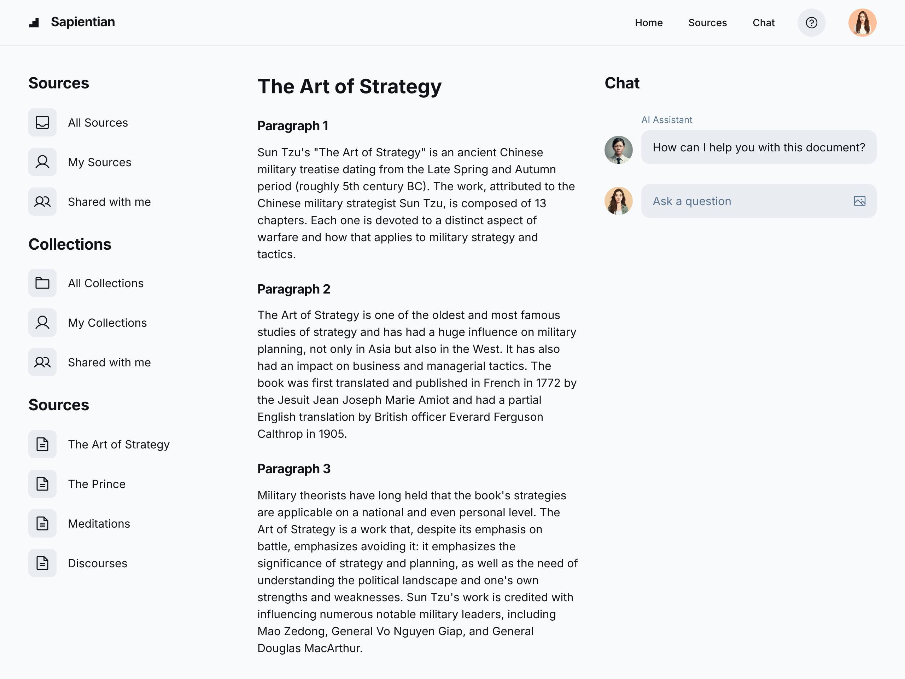

# Sapientian
This project's goal is to create a learning copilot and second brain for people to learn and understand topics in a deep and comprehensive way. In the recent times, we have seen the rise in use of GenAI in education, general research and workplaces. 

However, to put it bluntly the tools have been too good at summarising and being convincing. This we personally feel has led to "brainrot" and "fake learning". How often do you remember or really learnt anything from these reports and AI Summaries? We want to create a tool that will help you learn and understand topics in a deep and comprehensive way. 

This would be a great tool for students, researchers, and professionals to use. There are other potential use cases such as trying to help people find new solutions to topics they completely had no prior knowledge. 
> For example, your family member is dealing with certain health issues, however you have no idea what to do and seeing different doctors and specialists and getting different opinions and treatments. You want to find a solution that is best for them. You can use this tool to gain knowledge and provide "copilot" knowledge to your doctor as a second opinion to enhance the likelihood of identifying the true problem and finding the best solution.

Tools to use and reference:
- Perplexica (uses searxng)
- Searxng
- Tavily (for more general search?)
- Google ADK 
- LangChain Tools
- LightRAG
- NaiveRAG
- Neo4j

LLM Providers Supported:
- Google
- Anthropic
- OpenAI
- OpenRouter
- Ollama
## Components
### 1 Current knowledge/config of user (json file)
- Dynamic prompt
- summary of whatever is inside the knowledge base
- user prefences
- question style, 
- known knowledge, 
- weaker topics, interests
- user's preferences and goals.
- data ingested, date, and short summary of those data.
### 2 Agent: topic finder agent
### 3 Agent: knowledge finder agent
### 4 Agent: knowledge extractor agent
### 5 Agentic chatbot that can answer questions based on the complexity. 
- **Base Chatbot** with tools to delegate to an **Agent for NaiveRAG** or an **Agent for LightRAG** if necessary. If basic question with no need of knowledge base, it can answer directly.
- Agent that automatically updates (1) **working information on the user**
- Agent that reviews the current responses and user questions and **determines if further research is needed** to find more papers and posts for the user to learn. This will call the original search agent to do so. Alongside the information base by the above agent. 
- Periodic Agent that calls the search agent to update the information base with new data. This is to ensure that the user will learn of new developments at the level they are at.
- "Deep search" Agent that crawls the current database to summarise the current knowledge for the user to review and see whether they are both on the same page.

# Ingestion Workflow (sequential workflow with 3 agents)

## STEPS 1-4 is a topic finder agent
1. User inputs ONE OR MORE topic of interest in the form of a text prompt
2. Sapientian generates a research plan about sub-topics/related topics from base model knowledge
3. For each item in the plan, Sapientian will generates a search query based on the original prompt and throws the search query into a search tool to find relevant information in a deep research way
    - Can be more general search tool (tavily or google search api)
4. Sapientian collates search results and generates a list of sub topics of interests
---
Human in the loop: user chooses interested topics from the list of POI 
## STEPS 6  is a knowledge finder agent

6. Based on the selected POI list and the **"current knowledge"** of the user,  agent generates a custom list of search queries to be used in Searxng to find **papers** as well as well as posts from Subject Matter Experts (Open to other suggestions on what else to search for)This list will be displayed to the user.

## STEPS 8-11 is a knowledge extractor + quiz generator agent
8. The new knowledge will go to an agent that identifies POI within these papers and posts
-  Calls an agent\LLM call to check if POI is interesting using user config file
9. extracts these to the user to encourage them to read and understand and learn the content.
9. There will be a test section that dynamically generates dynamic and interactive quiz based on each paper/post. 
10. Once the user passes the test, the system will then ingest this into the knowledge base. (Both normal RAG and LightRAG)
11. it will check with the users whether they find the information interesting and useful. This will update the user config file so that future searches can be more relevant to the user.

# Features
- Script that *automatic periodic runs*, 
    1. Calls deep search agent to find a complete summary of everything learnt
    2. One LLM call to generate the POI list to give to Agent 2
- The user can choose to skip to ingesting into knowledge base directly but we don't encourage this. (skips to step x)
- This step can also be the start of for the user if they choose to skip all the quiz and want to use this app as a query bot. This allows users to upload pdfs/txt/docx/md/pptx
## UI Mockup

# Further Planning Decisions to make
- What type of NaiveRAG to use?
    - Basic RAG (which we can use the one built into LightRAG too)
    - Parent Document Retrieval RAG
    - HyDE
    - RAG Fusion
    - Hybrid RAG
- MCP?
- LangGraph or ADK? (I think for now we will stick to ADK)
- How are we building the UI??? Are we creating a local app or web app?
- What type of database to use?
    - MongoDB?
    - Postgres? (can share with LightRAG or we find another way for LightRAG)
    - Supabase?
- Do we build a Flask/FastAPI server and then build a web ui? This gives users the freedom to build some other way to use the app that we may not have time for. 
- Is this going to be open source? I think this is the path I want to go down at least. So realistically I think API server might be a good path.
- Story feature/ podcast
- Agent that **automatically cleans up the data ingested** by deleting old data that is no longer important based on the depth that the user has learnt (This is long term goal to add)
---

# Copilot Generated Setup Commands (To be verified and updated)

## Initial setup
chmod +x scripts/setup.sh
./scripts/setup.sh

## Start all services
docker-compose up -d

## Start with logs
docker-compose up

## Development mode (with hot reload)
docker-compose -f docker-compose.yml -f docker-compose.override.yml up

## Stop services
docker-compose down

## Rebuild and restart
docker-compose down && docker-compose up --build -d

## View logs
docker-compose logs -f ai-research-app
docker-compose logs -f searxng

## Health check
curl http://localhost:5000/health
curl http://localhost:8080/healthz

## Frontend
Open the static UI at `frontend/index.html`. If serving via Flask, ensure static routing or open the file directly in a browser and point requests to the backend base URL.