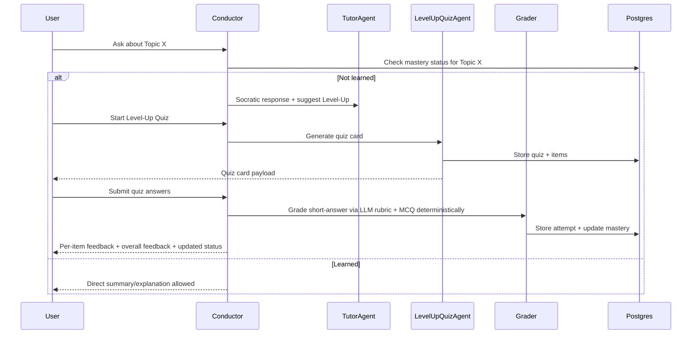

# docs/ARCHITECTURE.md

## System Overview
Coleonri is a learning-first agentic system with:
- **Socratic tutor by default**
- **Mastery-gated direct answers**
- **Level-up quizzes** as in-chat cards (submit all → grade → update mastery)
- A **canonical concept graph** users can browse for practice and exploration
- An “I’m feeling lucky” feature to encourage breadth

We build on:
- **FastAPI** backend
- **Postgres** (single DB) with:
  - `pgvector` for embeddings similarity
  - Postgres full-text search (`tsvector`) for keyword retrieval
  - graph tables for canonical/raw concepts and edges
- LLM provider abstraction (OpenAI or other)

---

## High-level architecture
```mermaid
flowchart TB
  API[FastAPI API] --> COND[Conductor / Router]
  COND --> TUTOR[TutorAgent (Socratic + mastery gating)]
  COND --> QUIZ[LevelUpQuizAgent (card + grading)]
  COND --> PRAC[PracticeAgent (flashcards + mini quizzes)]
  COND --> SUG[SuggestionAgent (I'm Feeling Lucky)]
  COND --> RET[Retriever (hybrid vector + FTS)]
  COND --> GRAPH[GraphBuilder (raw extraction + online resolver)]
  GRAPH --> GARD[GraphGardener (offline consolidation)]
  RET --> PG[(Postgres: chunks + embeddings + FTS + graph + mastery)]
  GRAPH --> PG
  API --> UI[Next.js UI (later)]
  COND --> LLM[LLM Provider]
````

---

## Ingestion pipeline

```mermaid
flowchart LR
  U[Upload .md/.txt] --> P[Parse/Normalize]
  P --> C[Chunk]
  C --> S[(Store chunks + tsvector + embeddings)]
  C --> X[Extract raw concepts/edges (LLM schema)]
  X --> R[(Store concepts_raw / edges_raw)]
  R --> RES[Online Resolver (bounded)]
  RES --> CAN[(Upsert canonical concepts/edges + provenance)]
  CAN --> DIRTY[Mark canon nodes dirty]
```

---

## Query pipeline (grounded answer)

```mermaid
flowchart LR
  Q[User message] --> ROUTE[Conductor routes]
  ROUTE --> RET[Hybrid Retrieval]
  RET --> EVID[EvidenceItems with provenance]
  EVID --> TUTOR[TutorAgent decides response style]
  TUTOR --> VERIFY[Verifier: citations + policy]
  VERIFY --> RESP[Response (text or card payload)]
```

---

## Level-up quiz flow (card)



---

## Repo structure (must remain clean)

```
apps/
  api/                  # FastAPI routes only (thin)
core/
  schemas.py            # Evidence, Citation, Card payload schemas
  contracts.py          # Tool/LLM interfaces
  loop.py               # Conductor orchestration (thin)
domain/
  agents/               # TutorAgent, QuizAgent, PracticeAgent, SuggestionAgent
  learning/             # mastery rules, state machine
  graph/                # graph policies + interfaces
adapters/
  db/                   # SQLAlchemy + queries + migrations helpers
  retrieval/            # vector + FTS hybrid retrieval
  parsers/              # md/txt now; pdf later
  llm/                  # provider wrapper, retries, tracing
tests/
docs/
```

**Rules:**

* `apps/api` may import `core`/`domain`/`adapters`
* `core` and `domain` must never import from `apps/`

---

## Key Interfaces (conceptual)

* `Retriever`: `retrieve(query, workspace_id, filters) -> list[EvidenceItem]`
* `GraphBuilder`: extracts raw nodes/edges per chunk + resolves into canonical
* `GraphGardener`: offline consolidation job (budgeted)
* `TutorAgent`: decides Socratic vs Direct based on mastery + user intent
* `LevelUpQuizAgent`: produces quiz card + grades + updates mastery

---

## Non-goals (MVP)

* PDF crop/zoom vision ingestion
* Multi-modal image understanding
* Multi-tenant auth hardening beyond basic workspace isolation
* A fully-featured frontend (keep it minimal)
