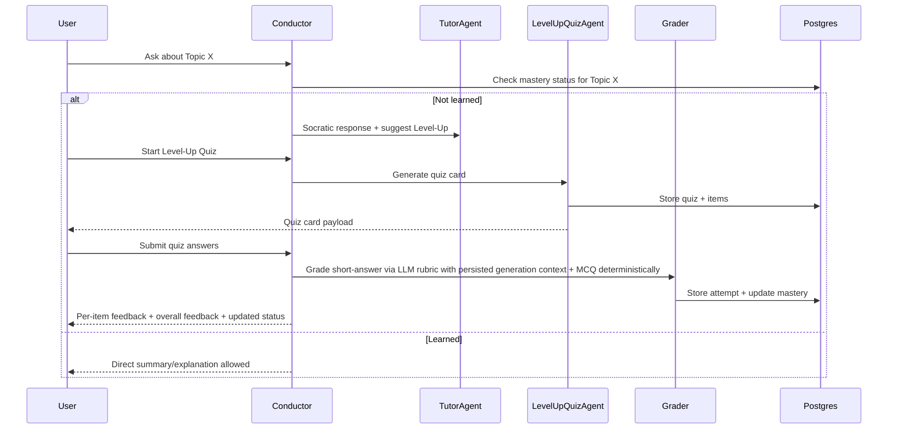
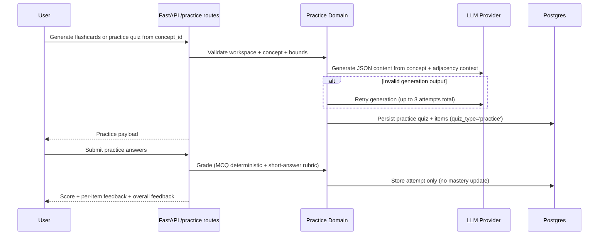

# docs/ARCHITECTURE.md

## System Overview
Coleonri is a learning-first agentic system with:
- **Socratic tutor by default**
- **Mastery-gated direct answers**
- **Level-up quizzes** as in-chat cards (submit all → grade → update mastery)
- A **canonical concept graph** users can browse for practice and exploration
- An “I’m feeling lucky” feature to encourage breadth

We build on:
- **FastAPI** backend
- **Postgres** (single DB) with:
  - `pgvector` for embeddings similarity
  - Postgres full-text search (`tsvector`) for keyword retrieval
  - graph tables for canonical/raw concepts and edges
- LLM provider abstraction (OpenAI or other)
- Observability via structured events + OpenTelemetry (OTLP export), with optional Arize Phoenix in dev

API endpoint contracts are documented in [API.md](API.md).

---

## High-level architecture

> **Status note (2026-02-28):** The current implementation uses functional
> orchestration modules rather than hard agent boundaries.  A guarded
> conductor with typed turn planning is the next target
> (see `docs/agentic/01_conductor_plan.md`).  A query analysis seam exists
> in `domain/chat/query_analyzer.py` but is not yet wired into the runtime.
> File-based prompt assets are already landed in `core/prompting/`.

```mermaid
flowchart TB
  API[FastAPI API] --> COND[Conductor / Router]
  COND --> TUTOR[TutorAgent (Socratic + mastery gating)]
  COND --> QUIZ[LevelUpQuizAgent (card + grading)]
  COND --> PRAC[PracticeAgent (flashcards + mini quizzes)]
  COND --> SUG[SuggestionAgent (I'm Feeling Lucky)]
  COND --> RET[Retriever (hybrid vector + FTS)]
  COND --> GRAPH[GraphBuilder (raw extraction + online resolver)]
  GRAPH --> GARD[GraphGardener (offline consolidation)]
  RET --> PG[(Postgres: chunks + embeddings + FTS + graph + mastery)]
  GRAPH --> PG
  API --> UI[Next.js Web App (Sigma.js graph)]
  COND --> LLM[LLM Provider]
  COND --> OBS[Observability (Events + OTel)]
  OBS --> PHX[Phoenix (optional)]
```

---

## Ingestion pipeline

```mermaid
flowchart LR
  U[Upload .md/.txt] --> P[Parse/Normalize]
  P --> C[Chunk]
  C --> S[(Store chunks + tsvector + embeddings)]
  C --> X[Extract raw concepts/edges (LLM schema)]
  X --> R[(Store concepts_raw / edges_raw)]
  R --> RES[Online Resolver (bounded)]
  RES --> CAN[(Upsert canonical concepts/edges + provenance)]
  CAN --> DIRTY[Mark canon nodes dirty]
```

---

## Query pipeline (grounded answer)

```mermaid
flowchart LR
  Q[User message] --> ROUTE[Conductor routes]
  ROUTE --> RET[Hybrid Retrieval]
  RET --> EVID[EvidenceItems with provenance]
  EVID --> TUTOR[TutorAgent decides response style]
  TUTOR --> VERIFY[Verifier: citations + policy]
  VERIFY --> RESP[Response (text or card payload)]
```

---

## Level-up quiz flow (card)



---

## Practice flow (non-leveling)



Practice constraints:
- Practice routes remain thin and only delegate to domain functions.
- Practice submissions are idempotent on replay and return the stored graded attempt.
- Practice flows do not transition mastery to `learned`.

---

## Repo structure (must remain clean)

```
apps/
  api/                  # FastAPI routes only (thin)
  web/                  # Next.js web app (tutor, KB, graph, login)
    components/sigma-graph/  # Sigma.js WebGL graph rendering (graphology + @react-sigma/core)
    lib/graph/               # Graph data transform, layout, search (minisearch)
core/
  schemas/              # Evidence, Citation, Card payload schemas
  contracts.py          # Tool/LLM interfaces
  prompting/            # File-based prompt asset system (landed)
    assets/             # Versioned Markdown prompt files by task family
    registry.py         # PromptRegistry – load/cache/render prompt assets
    loader.py           # Asset loading with front-matter parsing
    renderer.py         # Strict placeholder rendering
    models.py           # PromptMeta, PromptAsset, TaskType types
  verifier.py           # Grounded answer verification (verify_assistant_draft)
domain/
  chat/                 # Tutor orchestration (respond, stream, query_analyzer, tutor_agent)
  learning/             # mastery rules, level-up, practice
  graph/                # graph extraction, resolver, gardener, exploration
  readiness/            # readiness analyzer
  research/             # research service, runner
adapters/
  db/                   # SQLAlchemy + queries + migrations helpers
  retrieval/            # vector + FTS hybrid retrieval
  parsers/              # md/txt/pdf
  llm/                  # provider wrapper, retries, tracing
tests/
docs/
```

**Rules:**

* `apps/api` may import `core`/`domain`/`adapters`
* `core` and `domain` must never import from `apps/`

---

## Key Interfaces (conceptual)

* `Retriever`: `retrieve(query, workspace_id, filters) -> list[EvidenceItem]`
* `GraphBuilder`: extracts raw nodes/edges per chunk + resolves into canonical
* `GraphGardener`: offline consolidation job (budgeted)
* `TutorAgent`: decides Socratic vs Direct based on mastery + user intent
* `LevelUpQuizAgent`: produces quiz card + grades + updates mastery

---

## Observability (MVP+)

Goals:
- Trace grading and graph-budget behavior end-to-end.
- Track token/call cost where provider responses expose usage metadata.
- Correlate app logs, spans, and request IDs for debugging.

Requirements:
- Instrument level-up/practice grading, resolver, and gardener paths with structured events.
- Emit budget stop reasons explicitly.
- Keep observability provider-agnostic; Phoenix should be optional and enabled by env.
- Never log secrets or full sensitive payloads.

See [OBSERVABILITY.md](OBSERVABILITY.md) for local Phoenix setup and event reference.

---

## Frontend graph rendering

The concept graph is rendered client-side using **Sigma.js** (WebGL) backed by
**graphology** for the in-memory graph data structure.  Key dependencies:

| Package | Role |
|---|---|
| `graphology` | In-memory graph model |
| `sigma` | WebGL graph renderer |
| `@react-sigma/core` | React bindings for Sigma.js |
| `minisearch` | Client-side fuzzy node search |

Graph data flows from the `/graph/explore` API → `lib/graph/transform.ts`
(maps API nodes/edges to graphology) → `components/sigma-graph/` (renders via
Sigma.js with force-atlas layout, hover/click reducers, and search overlay).

---

## Non-goals (MVP)

* PDF crop/zoom vision ingestion
* Multi-modal image understanding
* Multi-tenant auth hardening beyond basic workspace isolation
* Free-form multi-agent runtime (deferred; see `docs/FUTURE_FREEFORM_MULTI_AGENT.md`)
