# LLM Call Flows

This document maps the implementation-level LLM call paths in the current codebase.

## Scope

All model traffic funnels through the `GraphLLMClient` protocol in `core/contracts.py` and is built by `adapters/llm/factory.py`.

There are only three provider primitives:

1. `generate_tutor_text`
2. `extract_raw_graph`
3. `disambiguate`

Every higher-level "agent" or background job eventually routes into one of those three methods.

## Call Inventory

| ID | Entrypoint | Primitive | Main purpose | Bound / fallback |
| --- | --- | --- | --- | --- |
| C1 | Chat social fast-path | `generate_tutor_text` | Short social reply | Falls back to local template reply |
| C2 | Chat grounded tutor response | `generate_tutor_text` | Main tutor answer | Falls back to deterministic tutor text |
| C3 | Post-ingest summary | `generate_tutor_text` | 2-3 sentence document summary | Silent skip on failure |
| C4 | Graph extraction | `extract_raw_graph` | Extract raw concepts and edges per chunk | Schema validation required |
| C5 | Online resolver disambiguation | `disambiguate` | Merge-vs-create decision for ambiguous concepts | Budgeted, else deterministic fallback |
| C6 | Graph gardener cluster merge | `disambiguate` | Pick canonical concept inside a dirty cluster | Budgeted, else skip cluster |
| C7 | Level-up quiz generation | `generate_tutor_text` | Produce quiz items JSON | Up to 3 attempts, then auto-generated quiz |
| C8 | Short-answer quiz grading | `generate_tutor_text` | Grade short answers with JSON rubric output | Falls back to keyword grading if no LLM |
| C9 | Practice flashcard generation | `generate_tutor_text` | Generate transient flashcards | Request fails if generation is invalid |
| C10 | Practice quiz generation | `generate_tutor_text` | Generate practice quiz items JSON | Up to 3 attempts, then fallback auto-items |
| C11 | Stateful flashcard generation | `generate_tutor_text` | Generate persisted flashcards with novelty filtering | Request fails if generation is invalid |

Background entrypoints reuse existing calls instead of adding new provider methods:

- `apps/jobs/quiz_gardener.py` reuses `C7`
- `apps/jobs/graph_gardener.py` reuses `C6`
- `domain/learning/practice.py::submit_practice_quiz` reuses `C8`

## Shared Provider Path

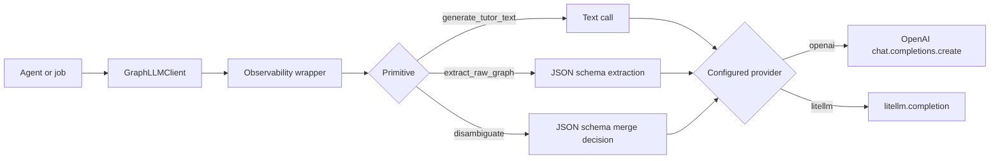

## Per-Call Flows

### C1. Chat Social Fast-Path

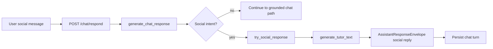

Notes:

- Runs before retrieval and evidence assembly.
- If the call fails, the code falls back to `build_social_response`.

### C2. Chat Grounded Tutor Response

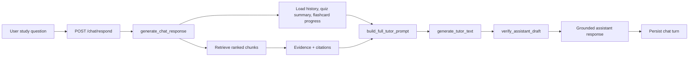

Connections:

- Pulls quiz results into the prompt via `build_quiz_context`.
- Pulls practice state into the prompt via `load_flashcard_progress`.
- Uses document summaries produced by `C3`.

### C3. Post-Ingest Document Summary

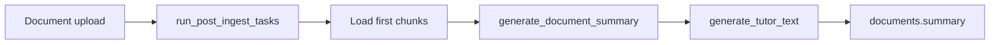

Connection:

- The stored document summary is later injected into the tutor prompt used by `C2`.

### C4. Raw Graph Extraction Per Chunk

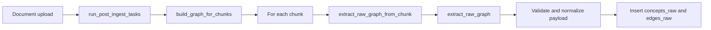

Notes:

- This is one LLM extraction call per chunk.
- The extracted concepts then flow into `C5`.

### C5. Online Resolver Disambiguation

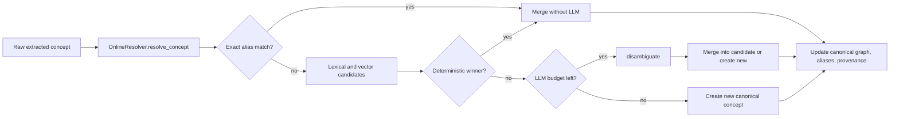

Notes:

- This is the main bounded merge-vs-create decision for ingestion.
- Edge endpoint resolution can also re-enter this same path.

### C6. Graph Gardener Cluster Merge

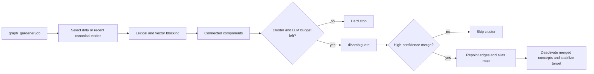

Connection:

- Reuses the same `disambiguate` primitive as `C5`, but at cluster level against canonical nodes.

### C7. Level-Up Quiz Generation

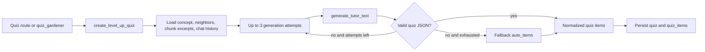

Connections:

- Called directly from the level-up quiz route.
- Also called indirectly by `quiz_gardener`.

### C8. Short-Answer Quiz Grading

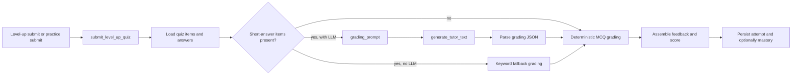

Connections:

- `submit_practice_quiz` delegates into this exact path with `update_mastery=False`.
- `submit_level_up_quiz` uses the same path with mastery updates enabled.

### C9. Practice Flashcard Generation

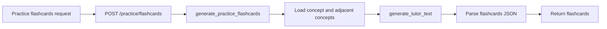

### C10. Practice Quiz Generation

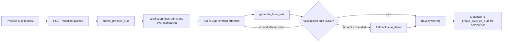

Connection:

- Shares persistence and item-shaping logic with the level-up quiz flow after generation.

### C11. Stateful Flashcard Generation

```mermaid
flowchart LR
  U["Stateful flashcards request"] --> API["POST /practice/flashcards/stateful"]
  API --> GEN["generate_stateful_flashcards"]
  GEN --> NOVEL["Load seen fingerprints"]
  NOVEL --> LLM["generate_tutor_text"]
  LLM --> PARSE["Parse flashcards JSON"]
  PARSE --> FILTER["Novelty filter and dedupe"]
  FILTER --> BANK["Persist flashcard bank, progress, run metadata"]
  BANK --> OUT["Return persisted flashcards"]
```

## Overall Graph

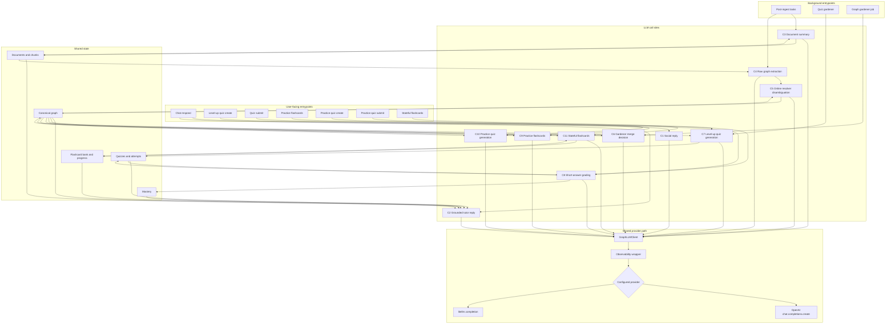

## Cross-Agent Connections Worth Calling Out

1. Chat is downstream of both quiz and practice systems.
   `C2` injects quiz summaries and flashcard progress into the tutor prompt, so practice and assessment outputs directly shape the next tutor response.

2. Practice quiz submit is not its own grading agent.
   `submit_practice_quiz` delegates into `submit_level_up_quiz`, so practice and level-up share the same short-answer LLM grading path.

3. Practice quiz create is not its own persistence agent.
   `create_practice_quiz` generates its own items, then delegates persistence to `create_level_up_quiz`.

4. Quiz gardener is a background caller of the same level-up generation path.
   It does not define a separate model prompt family; it reuses `C7`.

5. Post-ingest graph work feeds almost everything else.
   `C4` and `C5` build the canonical graph, which then powers retrieval, quiz context, and practice context.

6. Document summary is upstream of tutor prompts.
   `C3` stores document summaries, and `C2` later pulls them into the chat prompt.
